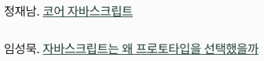

Astro 7이 나왔다. 블로그도 업그레이드 하면서 필요했던 마크다운 기능도 추가했다.

## Astro 7 업그레이드

Astro 7은 `.astro` 컴파일러를 Rust로 재작성했다. 여기에 `Vite 8`까지 적용해서 빌드 속도가 빨라졌다고 한다. 내 블로그는 문서가 별로 없어서 큰 차이는 없을 거라고 생각했는데, 빌드 시간이 0.043초에서 0.035초로 줄긴 했다.

그 외에 메이저 버전이 올라간 디펜던시도 함께 업그레이드를 했다. 주로 `ESLint` 관련이었고 큰 변화는 없었다.

TypeScript도 7이 나왔다. 요즘은 AI 때문인지 다들 버전 업그레이드가 빠르고 전반적으로 성능 향상에 집중하는 분위기다. TS는 나온 지 며칠 안 돼서 아직 다른 디펜던시와 호환성 문제가 있을 것 같아 이번에는 올리지 않았다.

## 기본 마크다운 파이프라인 Sätteri

Astro 7부터 기본 마크다운 파이프라인이 `Satteri`로 바뀌었다. Satteri도 Rust로 작성돼서 빠른 게 장점인데 알고보니 Astro 코어 팀원이 만든 거였다.

글을 작성할 때 몇 가지 필요한 마크다운 기능이 있었는데, 이번 기회에 하나씩 만들어봤다.

### 이미지 캡션

예전에는 이미지 밑에 캡션을 달고 싶어도 마크다운에는 없는 문법이라 `mdx`에서 `small` 태그를 사용하고 있었다.

```mdx


<small>이미지 캡션</small>
```

Satteri에 이미지 캡션 플러그인을 연결해서 마크다운 문법만으로 처리할 수 있게 바꿨다.

```md
")
```

### Note와 이미지 정렬

노션의 콜아웃이나 노트 같은 기능도 필요했는데, `directive` 플러그인을 이용해 Note를 만들고, 이미지 중앙 정렬과 Row 정렬도 함께 추가했다.

```md
:::note{title="NOTE"}
노트를 작성할 수 있다.
:::
```

:::note{title="NOTE"}
노트를 작성할 수 있다.
:::

중앙 정렬과 Row도 똑같이 `:::center`와 `:::row`를 사용하면 된다.

```md
:::center

:::

:::row


:::
```

### mdast와 hast

`Satteri`는 플러그인이 두 종류로 나뉜다. `mdast`와 `hast`.

이 두 개는 `unified` 마크다운 생태계에서 쓰는 AST 규격인데,

- `mdast`는 마크다운 추상 트리 규격이고
- `hast`는 HTML 추상 트리 규격이다.

그리고 이 두 단계를 거쳐 최종 HTML을 생성한다. 정리하자면, `Markdown > mdast > hast > HTML`이 된다.

unified 생태계에서 `remark`는 mdast 단계를 담당하고 `rehype`는 hast 단계를 담당한다. Satteri는 이 두 종류의 단계를 플러그인 훅으로 제공해서 쓸 수 있게 해준다.

```js title="astro.config.mjs"
markdown: {
  processor: satteri({
    features: { directive: true },
    mdastPlugins: [directivesPlugin()],
    hastPlugins: [imageCaptionsPlugin()],
  }),
},
```

그래서 `directive`는 마크다운 AST를 다루는 단계에서 사용되고, 이미지 캡션은 HTML AST를 다루는 단계에서 사용된다.

## 외부 링크 아이콘 추가



원래 링크 텍스트는 밑줄만 적용했는데, 본문 안에서 시각적으로 충분히 구분되지 않았다.

그래서 외부 링크에는 [아이콘](https://sageherb.dev)을 붙이도록 스타일을 수정했다.

## 코드 블럭 테마 변경

코드 블럭 스타일도 함께 정리했다.

기존에는 GitHub Light, Dark 테마를 사용했고, 코드 블럭에 `border`가 있었다.

이번에는 border를 제거하고, 테마를 내가 제일 좋아하는 `Catppuccin`으로 변경했다.

```js
console.log("Catppuccin Mocha and Frappe");
```

라이트 모드에서는 Catppuccin Frappe, 다크 모드에서는 Catppuccin Mocha를 사용하도록 설정했다.

## 마무리

마크다운 기능을 더 추가해서 이제 웬만한 글은 `mdx`를 쓰지 않고 `md`만으로 처리가 가능하게 됐다.

블로그를 직접 만들고 유지하면서 생각 이상으로 배우는 게 많다.

마침 며칠 전에 `remark`로 이력서 PDF 자동화 프로젝트를 만들었는데, 이번엔 `Satteri`를 연달아 다루면서 마크다운 파싱 과정에 대한 이해가 많이 늘었다.
