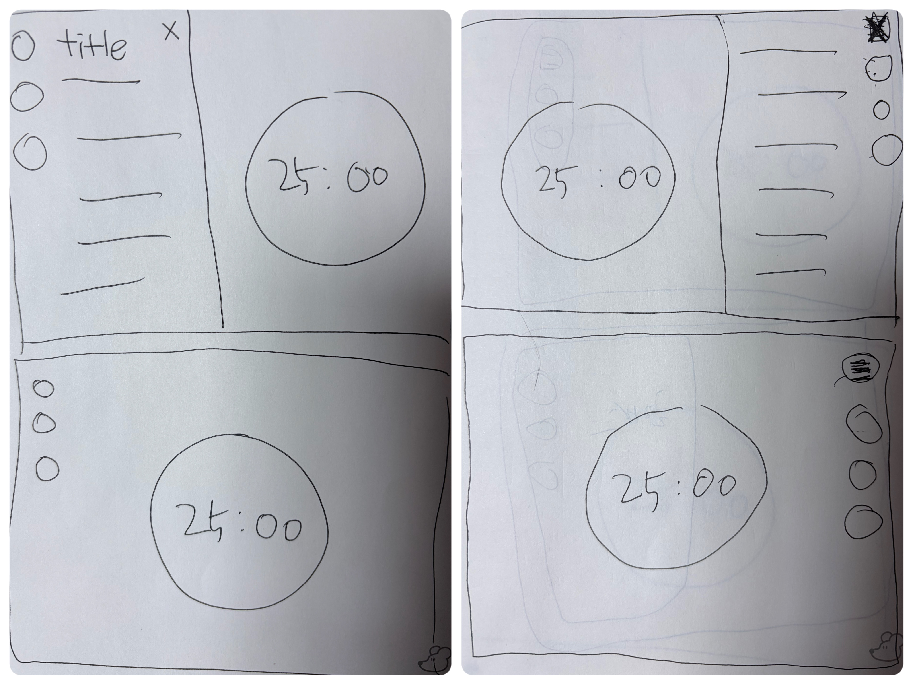
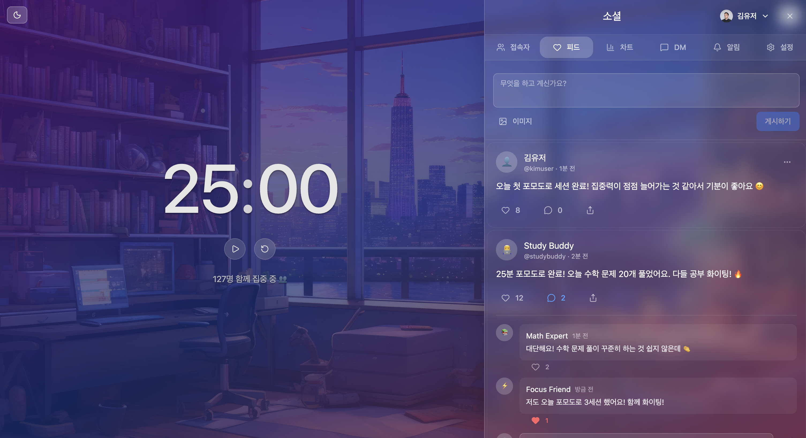
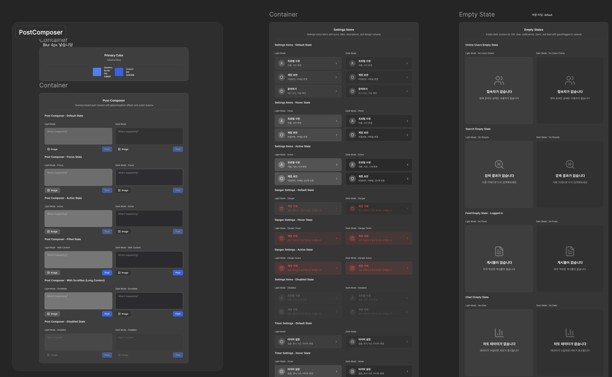
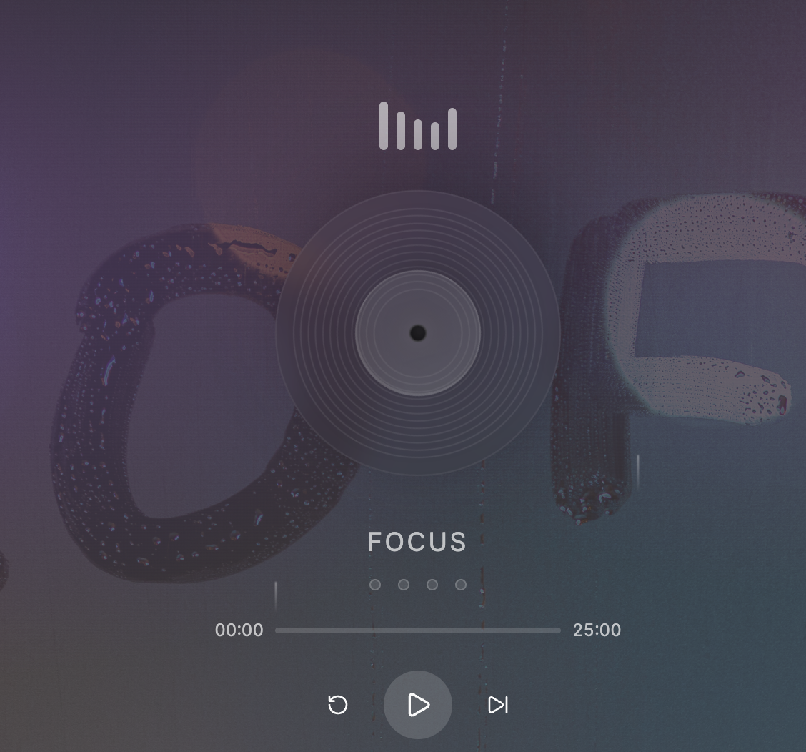

## 두 번째 팀 프로젝트

2025년 10월, 약 3주 동안 데브코스에서 2차 팀 프로젝트를 진행했다. 팀원은 나를 포함해 총 3명이었고, 기획과 디자인도 포함된 일정이었다.

이번 프로젝트는 데브코스에서 제시한 요구 사항을 바탕으로 소셜 커뮤니티 웹 사이트를 구현하는 프로젝트였고, 기술 스택은 `React`, `TypeScript`, `Supabase`, `Tailwind CSS`, `Vite` 등을 사용했다.

필수 요구 사항은 회원, 게시글 CRUD, 댓글, 좋아요 등의 기능이었고 선택 요구 사항은 다크 모드, 실시간 접속 등이 있었다.

나는 2년 정도 코딩을 쉬었고, 리액트를 제외하곤 모두 처음 사용하는 기술이었다. 팀 인원도 3명으로 다른 팀에 비해 한 명이 적었기 때문에 많은 고민을 했던 프로젝트였다.

이 프로젝트는 구현 난이도가 높았다기보단, 디자인 방향성, UI/UX, 완성도, 디자인 시스템의 비중이 큰 프로젝트였다. 아래는 그 과정에서 특히 깊게 다뤘던 부분들이다.

### 디자인과 Figma Make

부트 캠프에선 디자이너가 따로 없으니 모든 디자인을 직접 해야 하는데, 팀원은 셋이고 셋 다 디자인 경험이 없었다.

우리 팀 주제는 내가 제안한 아이디어인 `Lofi 뽀모도로 소셜 커뮤니티`였다.

평소 Lofi 음악을 자주 듣고 뽀모도로를 많이 사용하기 때문에 낸 아이디어인데, Lofi 장르는 감성과 분위기가 굉장히 중요해서 이 주제를 살리는 디자인이 큰 과제였다.

레퍼런스로 찾아본 사이트는 [flocus](https://app.flocus.com/)와 [WonderSpace](https://www.wonderspace.app/)인데, 둘 다 깔끔하면서 뽀모도로가 메인이 되는 사이트다. 우리는 여기에 데브코스에서 필수로 제시한 소셜 커뮤니티 기능을 넣어야 해서 UI/UX적인 고민도 많이 필요했다.

그래서 생각한 아이디어는 접었다 펼 수 있는, 화면의 반 정도를 차지하는 검은색의 반투명한 패널에 커뮤니티 기능을 넣는 것이었다.

당시 나는 `Figma`가 처음이라 이미지를 빨리 만드는 게 어려워서 빠른 설명을 위해 패널 위치와 아이콘 배치를 직접 손으로 그리며 팀원들과 회의를 했다.

그렇게 오른쪽의 검은 반투명 패널로 일단 정하고 디자인을 시작했는데 생각보다 결과가 만족스럽지가 않았다. 그러다 몇 달 전 개인 멘토링 때 멘토님께서 요즘 `Figma`에 AI가 새로 나왔다고 지나가듯 말씀하신 게 기억이 나서 `Figma Make`를 이용해봤다.

상상으로만 고민하던 걸 AI로 금방 프로토타입을 만들 수 있어서 UI/UX는 생각보다 빨리 결정됐다. 문제는 디테일한 디자인이었는데, `Lofi Girl`이나 `Chillhop`, `essential;` 같은 세련되고 깔끔한 디자인을 살리기가 어려웠다. 검은색 반투명 패널론 전체적으로 부족한 느낌이 있었다.

당시 `iOS 26`이 공개된 지 얼마 안 됐을 때였는데, 나는 그런 반투명하고 세련된 디자인을 하고 싶었다. 그때 팀원 한 명이 지나가면서 "이런 디자인을 글래스모피즘이라고 한대요."라고 말을 해줬다.

주변에서 한 명씩 던져준 키워드와 AI를 이용해 원하는 분위기와 근접하게 프로토타입을 만들 수 있었다.

### Glassmorphism + UI Kit

글래스모피즘은 아예 장르가 있는 디자인 기법이라 이름을 알고나니 레퍼런스를 찾는 게 수월해졌다. 그리고 피그마는 좋은 퀄리티의 작업물을 커뮤니티에 공개한 게 많아서 그걸 보고 `UI Kit` 단위로 디자인을 관리한다는 걸 알게 됐다. 당시에는 디자인 시스템이라는 개념도 모를 때였는데, 레퍼런스와 커뮤니티를 보며 UI Kit 단위로 디자인을 관리하는 방식의 장점을 자연스럽게 익힐 수 있었다.

그래서 모든 UI Kit를 Figma Make를 이용해 뽑았다. 천운인지, 처음에는 Figma Make 결과물을 피그마 디자인으로 옮기는 기능이 없어서 유료 플러그인을 찾아 하나씩 옮기는 과정을 거쳐야 했는데 중간에 피그마 디자인으로 옮기는 기능이 업데이트 됐다.

글래스모피즘은 투명과 입체감을 위해 `blur`, `border`의 리니어와 그림자 효과를 많이 사용하는데, 성능 개선을 제대로 못하면 부담이 있을 거라고 생각해서 팀원들과 상의 후 `blur`는 정말 필요한 부분에만 넣고 그림자와 border 리니어는 빼고 최대한 투명도를 이용하는 방향으로 구현했다.

리퀴드 글래스모피즘은 아니지만, 프로스트 글래스모피즘에 근접한 느낌을 많이 살리려고 했다.

### Class Variance Authority + Variants

기획과 디자인을 정리하고 가장 처음 시작한 건 공통 컴포넌트를 나눠서 작업하는 것이었다.

나는 버튼 컴포넌트를 맡았는데 버튼 하나에 바뀌는 스타일이 많았다. 다크/라이트 모드, 아이콘 유무, 형태, 크기, 스타일 등 조건 분기가 복잡했다. `twMerge`만으로 조건을 처리하는 게 가장 적절한가 하는 의문이 들었다.

그래서 방법을 검색해보면서 이런 경우 `cva`를 활용해 `variants`로 관리하는 방식을 사용한다는 걸 알게 됐고 팀원들과 상의한 뒤 라이브러리를 도입했다. 다른 팀원도 맡은 공통 컴포넌트를 cva를 활용하는 것으로 변경했다. 이후 4차 프로젝트에서 `shadcn`을 도입했을 때 유사한 방식으로 스타일을 관리하고 있어, 당시 선택한 방향이 합리적인 방향이었던 것 같아 다행이었다.

이 프로젝트를 통해 디자인 시스템의 활용과 필요성을 많이 배웠다. 디자인 단계에서는 `UI Kit` 단위로 정리하고, 구현할 땐 컴포넌트 `variants`와 디자인 토큰으로 스타일을 관리하면 프로젝트의 디자인 일관성과 작업 효율을 함께 높일 수 있다는 걸 체감했다.

### Supabase + OAuth

프로젝트의 데이터베이스 설계와 전체적인 관리를 맡았는데, 데이터베이스 설계는 사실 어렵지 않았지만 처음 보는 `RLS(Row Level Security)` 관리가 조금 까다로웠다. 사용자별 CRUD 권한이 따로 관리되는 줄 몰라 나중에 에러를 접하고 전체적으로 점검하고 설계하는 과정을 거쳤다.

하지만 Supabase는 공식 문서가 친절하고, `TypeScript`를 위해 데이터베이스 스키마 파일까지 제공해주고 있어서 쓰면서 많이 편하다고 느꼈다.

OAuth도 추상화된 메소드와 공식 문서를 제공해서 어렵지 않게 구현할 수 있었다. Google, Kakao, GitHub 로그인을 구현했는데 각 플랫폼에서 제공하는 회원 정보를 우리 프로젝트에 맞게 가공하는 SQL을 작성하면 자동으로 함수가 실행되도록 설정해서 데이터 구조를 맞출 수 있었다.

하지만 인증 인가는 더 깊게 공부해야 하는 영역이라고 느낀다. 늘 추상화된 메소드만 사용하다보니 내부 동작 원리를 완벽하게 이해하기 힘든 부분이 있어 스스로 계속 점검하게 된다.

### Motion

프로젝트가 기획과 디자인 비중이 컸던 만큼, 완성도를 높이는 디테일도 함께 챙기려고 했다. 그게 애니메이션과 음악이었다. 사실 처음부터 음악 기능을 넣을 계획은 없었는데, 프로젝트 막바지에 완성도를 높이기 위해 급하게 음악을 추가하게 됐다.

그 과정에서 뽀모도로 타이머의 UI 디자인도 전부 다시 만들었다. 음악 재생과 타이머 재생 두 버튼이 공존하면 UX가 어색해질 수 있다고 판단했고, 재생 버튼은 뽀모도로 타이머에 두고 타이머 숫자를 음악 재생 바처럼 만들었다.

음악 재생과 정지는 레코드 판 클릭 이벤트로 처리했고, 음악이 재생 중이라는 상태를 시각적으로 보여주기 위해 레코드 판이 회전하고 비주얼 이퀄라이저가 움직이도록 만들었다.

또한 배경에는 전체적으로 비가 내리는 레인 이펙트를 추가했다. 음악과 이미지는 무료로 이용 가능한 에셋을 사용했다.

다만 애니메이션을 많이 넣는다고 무조건 완성도가 높아지는 것도 아니고, 성능에도 부담이 될 수 있다고 생각했다. 그래서 모든 요소에 넣기보다는 Lofi 감성과 분위기를 만드는 요소에 집중적으로 적용했다.

반대로 패널처럼 사용자가 콘텐츠를 읽거나 조작해야 하는 주요 영역에는 버튼 인터랙션과 화면 전환 `duration` 정도만 적용해 사용자 경험을 방해하지 않도록 조절했다.

### 마무리

두 번째 팀 프로젝트는 UI/UX와 디자인 시스템, 서비스 완성도에 대해 특히 많이 생각하게 만든 프로젝트였다.

처음 사용하는 기술이 많았고, 디자인도 처음 해봤다. `Figma`나 디자인 시스템에 대한 이해도 부족했지만, 프로젝트를 진행하면서 `UI Kit`, `variants`, `디자인 토큰` 등의 방식이 왜 필요한지 배울 수 있었다.

이 프로젝트에서는 아키텍처와 폴더 구조에도 신경을 많이 썼다. `FSD`를 처음 공부하고 도입해봤고, 전체적인 컴포넌트 구조는 아토믹 패턴으로 설계했다.

하지만 작은 규모의 프로젝트에서는 FSD가 오히려 구조를 더 복잡하게 만들 수 있다는 것도 느꼈다. 이후에는 특정 아키텍처가 좋다고 무조건 도입하기보단 프로젝트의 규모와 성격에 맞게 판단해야 한다는 기준도 갖게 됐다.

코드 리뷰의 장점도 크게 느낀 프로젝트였다. 리뷰 과정에서 팀원의 버그를 발견했는데, 모든 코드를 꼼꼼히 읽는 게 많은 도움이 됐다.

여러모로 이 프로젝트는 여러 가지를 배우고 좋은 영향을 많이 준 고마운 프로젝트다.
