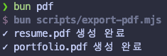

요즘 이력서와 포트폴리오를 열심히 만들고 있다. 내용을 수정할 때마다 디자인과 레이아웃을 다시 확인하고 PDF 파일을 새로 생성하는 일이 번거로워서, 문서만 수정하면 자동으로 PDF가 출력되는 프로젝트를 만들어봤다.

## 이력서 수정의 늪

처음 이력서를 만들었을 땐 `Figma`를 이용해 깔끔하게 만들었다. 문제는 이력서 내용이 생각보다 자주 바뀌는데 그때마다 수정 비용이 너무 컸다. 내용만 수정하고 싶은데 디자인과 레이아웃까지 수정하고 있는 게 비효율적이라고 느꼈다.

그래서 일단 노션으로 이력서 내용만 따로 정리했다. 수정은 빨라졌지만 노션의 PDF 내보내기 기능은 폰트 크기나 레이아웃 같은 세부 설정이 불가능한 단점이 있었다.

취업 관련 사이트에서 제공하는 템플릿도 이용해봤다. 하지만 이력서를 수정할 때마다 사이트에 들어가 정해진 포맷 안에서만 내용을 바꾸는 방식도 내가 원하는 방향은 아니었다.

나는 마크다운 문서만 수정하면, 원하는 디자인으로 PDF 이력서와 포트폴리오를 출력하고 싶었다.

## 목표: md 파일만 수정하면 PDF 출력

목표는 단순했다.

1. 이력서와 포트폴리오는 `Markdown` 파일로 관리한다.
2. 마크다운 파일을 디자인이 적용된 페이지로 렌더링한다.
3. 최종 결과물을 PDF로 출력한다.
4. 이력서 수정 시 `.md` 파일 외의 수정은 최소화한다.

## remark + React + Puppeteer

마크다운 파싱은 `remark`를 사용했다. 내 이력서는 노션의 콜아웃 같은 디자인도 필요했고 같은 마크다운 문법이라도 위치에 따라 렌더링이 달라져야 하는 부분이 있었다. 그래서 `HTML`로 바로 변환하기보다 AST 구조로 직접 처리할 수 있는 `remark`가 더 적합하다고 판단했다.

파싱한 마크다운 트리는 `React` 컴포넌트로 매핑해 렌더링했다. UI를 컴포넌트로 나누어 관리하고, dev 서버에서 수정 결과를 바로 확인했다.

마지막으로 렌더링 된 페이지를 `Puppeteer`를 사용해 PDF로 추출했다.

## Bun

예전부터 `Bun`이 빠르다는 말은 들었지만, 자세히는 모르고 패키지 매니저 정도로만 알고 있었다. 알고 보니 런타임, 번들러, 테스트 러너, 패키지 매니저까지 지원하는 툴킷이었다.

이번 프로젝트에서는 PDF 추출 스크립트를 자주 실행할 것 같아 `Bun`을 사용해봤다.

```json
"scripts": {
  "pdf": "bun scripts/export-pdf.mjs"
},
```

솔직히 말하면 작은 프로젝트라 그런지 PDF 추출 시 `Node.js`와 속도 차이는 체감하지 못했다. 번들러는 `React` 개발 환경 때문에 `Vite`를 사용했고, 테스트 러너가 필요한 프로젝트도 아니어서 `Bun`의 장점을 모두 활용한 것은 아니었다.

그래도 런타임과 패키지 매니저를 `Bun`으로 통일해서 명령어와 실행 환경이 단순해지는 점은 좋았다. 무엇보다 `Bun`이 단순한 패키지 매니저가 아니라 4개의 툴을 함께 제공하는 툴킷이라는 점을 확실하게 알 수 있었다.

## 결과: 이력서 수정 방식 개선



예전에는 이력서를 한 번 수정할 때마다 레이아웃이나 줄바꿈을 일일이 확인하고 다시 PDF로 저장해야 했다. 지금은 `resume.md` 와 `portfolio.md` 파일을 수정한 뒤 `bun pdf`만 실행하면 PDF가 생성된다.

UI가 컴포넌트 단위로 관리되기 때문에 이력서와 포트폴리오가 동일한 디자인으로 통일성 있게 구현된다. 파일을 수정할 때마다 Git 커밋을 해서 버전 관리도 가능하다.

무엇보다 짧은 시간에 실제로 반복 작업을 줄이는 프로젝트를 만들었단 점에서 만족스러웠다.

## 마무리

사실 이 프로젝트는 학습의 목적이 아니라 이력서 수정 과정에서 반복되는 작업을 줄이기 위해 시작한 프로젝트였다.

그래도 직접 구현하고 사용하고, 이렇게 글로 정리하면서 새롭게 배우게 되는 것들이 있었다. 작은 자동화라도 내가 반복해서 겪는 불편을 줄인 경험이 굉장히 가치가 있었다.
