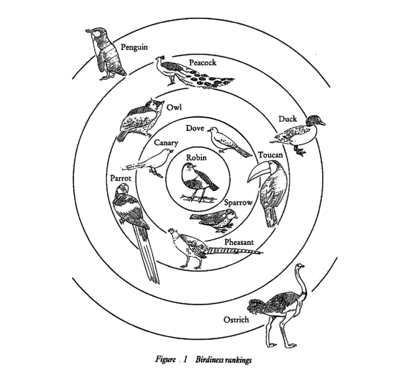

## Object-Oriented Programming

객체 지향 프로그래밍(OOP)은 프로그램을 `속성(Property)`과 `동작(Method)`이 있는 소프트웨어 `객체(Object)`로 나누고, 이 **객체들의 협력을 중심으로 설계**하는 프로그래밍 패러다임이다.

객체 지향 프로그래밍을 준수하는 대부분의 언어에서 객체는 클래스로 추상화된다. 클래스는 같은 범주로 분류(Classification)된 개체가 공유하는 속성과 동작을 정의한다.

JavaScript는 **프로토타입 기반 언어**로 객체 지향 프로그래밍이 가능하지만, 전통적인 클래스 방식이 아닌 프로토타입 방식을 지원한다. ES 2015에 클래스 문법이 추가되었다.



<small>
  이미지 출처: Laura Becker. [Class 8: Semantics & Prototype
  theory](https://laurabecker.gitlab.io/classes/as/08-semantics.pdf)
</small>

클래스가 비슷한 개체의 분류에 따른 추상화라면, 프로토타입은 `원형(Prototype)`을 중심으로 **유사성을 가진 객체들의 연결**이다. 그래서 클래스를 사용하는 다른 언어들과 객체 지향 프로그래밍을 구현하는 방식에 차이가 있다.

객체 지향 프로그래밍은 `캡슐화(Encapsulation)`, `추상화(Abstraction)`, `상속(Inheritance)`, `다형성(Polymorphism)` 네 가지 주요 개념이 있다.

### Encapsulation(캡슐화)

캡슐화는 프로퍼티와 메소드를 객체라는 단위로 묶는 것(Bundling)을 의미한다. 외부 코드가 객체 내부에 관여하지 못하게 한다.

캡슐화의 특징으로 `정보 은닉(Information Hiding)`이 있는데, 데이터에 직접 접근하지 못하도록 객체 내부의 정보를 숨기는 것이다.

캡슐화와 정보 은닉이 동일한 개념으로 쓰이는 경우가 많은데, 정보 은닉은 캡슐화에서 파생된 개념이며 캡슐화가 곧 정보 은닉은 아니다.

즉, 캡슐화는 프로퍼티와 메소드를 하나로 묶고 정보 은닉을 통해 객체 내 데이터의 무결성을 보호하는 개념이다.

자바스크립트에서는 클로저를 이용해 캡슐화를 구현할 수 있다. 아래 코드는 `Setter`도 구현되어 있지만, `Getter`만을 구현해 읽기 전용으로 만들 수도 있다.

```js
const counter = (function () {
  let privateCounter = 0;

  function changeBy(val) {
    privateCounter += val;
  }

  return {
    increment() {
      changeBy(1);
    },
    decrement() {
      changeBy(-1);
    },
    value() {
      return privateCounter;
    },
  };
})();

console.log(counter.value()); // 0

counter.increment();
counter.increment();
console.log(counter.value()); // 2

counter.decrement();
console.log(counter.value()); // 1
```

<small>
  코드 출처: MDN.
  [Closures](https://developer.mozilla.org/en-US/docs/Web/JavaScript/Guide/Closures#emulating_private_methods_with_closures)
</small>

ES 2022에선 클래스 내 정보 은닉을 위한 `Private` 기능이 추가됐다.

프로퍼티 및 메소드 앞에 `#`를 사용하면 비공개 멤버가 된다.

```js
class ClassWithPrivate {
  #privateField;
  #privateFieldWithInitializer = 42;

  #privateMethod() {
    // …
  }

  static #privateStaticField;
  static #privateStaticFieldWithInitializer = 42;

  static #privateStaticMethod() {
    // …
  }
}
```

<small>
  코드 출처: MDN. [Private class
  features](https://developer.mozilla.org/en-US/docs/Web/JavaScript/Reference/Classes/Private_class_fields)
</small>

### Abstraction(추상화)

추상화는 어떤 정보를 표시해야 하고 어떤 정보를 숨겨야 하는지 식별하는 기술이라고 할 수 있다.

객체(클래스)를 사용할 때, 객체 내부의 데이터는 어떻게 저장되는지 메소드는 어떻게 구현되는지 알 필요는 없다. 어떤 메소드를 사용할 수 있고 어떤 입력과 출력이 있는지만 알면 된다. 함수 또한 구현 세부 사항을 알 필요가 없다. 파라미터와 리턴만 알면 된다.

이렇게 복잡한 시스템을 단순화하고, 구현 세부 사항을 숨기는 기술을 추상화라고 한다.

추상화와 캡슐화는 서로 밀접한 관련이 있는 개념이고 혼동되기 쉽다. 캡슐화는 숨겨야 할 정보는 숨기고 표시해야 할 정보는 표시하는 방식으로 정보를 번들링 하는 기술이다.

```js
function Circle(radius) {
  this.radius = radius;
}

Circle.prototype.getCircumference = function () {
  return 2 * Math.PI * this.radius;
};

const circle = new Circle(1);
circle.getCircumference();
```

이 코드엔 radius 속성을 가진 원을 추상화한 `Circle`생성자 함수에, 둘레 계산을 추상화한 `getCircumference` 메소드가 있고, radius가 1인 Circle을 추상화한 인스턴스 `circle`이 있다.

`Circle`은 캡슐화 된 생성자 함수지만, 정보 은닉은 되지 않았다.

### Inheritance(상속)

상속은 객체 지향 프로그래밍에서 한 객체가 다른 객체로부터 프로퍼티와 메소드를 이어받을 수 있도록 하는 메커니즘이다. 객체를 `Super` ↔ `Sub` 계층 구조로 구성하고 `Super` 객체에서 정의한 공통 프로퍼티와 메소드를 `Sub` 객체가 상속 받아 코드의 재사용성을 높이고 다형성을 부여한다.

자바스크립트에서는 `프로토타입 체인`이나 클래스 문법의 `extends`를 이용해 상속을 구현한다.

### Polymorphism(다형성)

다형성은 하나의 인터페이스를 공유한 여러 객체가 각자 다른 모습(기능)을 갖는 것이다. 즉, 하나의 객체나 메소드가 다른 곳에서는 다른 동작(모습)을 하는 것이다.

일반적으로 다형성은 오버로딩과 오버라이딩으로 구현하지만, 자바스크립트는 동적 타입 언어이며 함수 내에 `arguments` 객체가 존재하기 때문에 오버로딩은 사용하지 않고 `오버라이딩(Overriding)`과 `덕 타이핑(Duck Typing)`을 이용해 다형성을 구현한다.

오버라이딩은 `Super` 객체의 메소드를 `Sub` 객체에서 다시 정의하는 것이다.

```js
function Animal(sleepingHours) {
  this.sleepingHours = sleepingHours;
}

Animal.prototype.sleep = function () {
  return this.sleepingHours + "시간 zzZ";
};

function Cat(sleepingHours) {
  Animal.call(this, sleepingHours);
}

Cat.prototype = Object.create(Animal.prototype);
Cat.prototype.constructor = Cat;

Cat.prototype.sleep = function () {
  return this.sleepingHours + "시간 zzZ 야옹";
};

const cat = new Cat(20);

console.log(cat.sleep()); // "20시간 zzZ 야옹"
```

이 코드는 `Animal`을 상속 받은 `Cat`에서 `sleep` 메소드를 재정의(오버라이딩)한다.

덕 타이핑은 ‘_오리처럼 걷고 오리처럼 꽥꽥거리면 오리임이 틀림없다_’는 말에서 나온 프로그래밍 개념으로, 어떤 객체인가보다 객체가 어떤 프로퍼티와 메소드를 갖고 있는 것인가가 더 중요한 것이다.

```js
function Cat(sleepingHours) {
  this.sleepingHours = sleepingHours;
}

Cat.prototype.sleep = function () {
  return this.sleepingHours + "시간 zzZ 야옹";
};

function Dog(sleepingHours) {
  this.sleepingHours = sleepingHours;
}

Dog.prototype.sleep = function () {
  return this.sleepingHours + "시간 zzZ 멍멍";
};

function sleepingAnimal(animal) {
  return animal.sleep();
}

const cat = new Cat(20);
const dog = new Dog(15);

console.log(sleepingAnimal(cat)); // "20시간 zzZ 야옹"
console.log(sleepingAnimal(dog)); // "15시간 zzZ 멍멍"
```

`sleepingAnimal` 함수는 어떤 객체가 전달되는지보다 해당 객체에 `sleep` 메소드가 있는지가 더 중요하기 때문에 이 함수는 덕 타이핑이다.

## JavaScript Prototype

자바스크립트의 모든 객체에는 `프로토타입(Prototype)`이 있다. 모든 객체가 속성과 메소드를 상속 받기 위한 템플릿으로써 프로토타입 객체를 가진다.

자바스크립트에서 `생성자(Constructor)` 함수를 `new` 연산자와 함께 호출하면 생성자 함수에서 정의된 내용을 바탕으로 새로운 인스턴스가 생성된다.

이 인스턴스에는 내부 슬롯 `[[Prototype]]`이 설정되는데, 이 슬롯은 생성자 함수의 `prototype`을 참조한다.

같은 생성자 함수로 생성된 인스턴스는 동일한 프로토타입을 참조한다.

```js
function Cat(name) {
  this.name = name;
}

Cat.prototype.getName = function () {
  return this.name;
};

const myFirstCat = new Cat("도");
const mySecondCat = new Cat("레");

Cat.prototype === Object.getPrototypeOf(myFirstCat); // true

Object.getPrototypeOf(myFirstCat) === Object.getPrototypeOf(mySecondCat); // true
```

이 참조를 통해 인스턴스는 생성자 함수의 `prototype`에 정의된 프로퍼티와 메소드를 사용할 수 있다.

`[[Prototype]]`은 생성자 함수에 `new` 연산자를 이용해 인스턴스를 생성할 때만 생기는 것은 아니다.

배열 리터럴(`[]`)을 사용해 배열을 만들면 자바스크립트는 자동으로 배열의 `[[Prototype]]`을 `Array` 생성자 프로토타입(`Array.prototype`)과 연결한다. 이를 통해 배열은 `Array` 메소드를 사용할 수 있다. 함수(`function`)와 객체(`{}`)도 마찬가지다.

### Prototype Chain

```js
myFirstCat {
  name: "도",
  [[Prototype]]: {                    // Cat.prototype
    getName: ƒ (),
    constructor: ƒ Cat(name),
    [[Prototype]]: {                  // Object.prototype
      constructor: ƒ Object(),
      hasOwnProperty: ƒ hasOwnProperty(),
      isPrototypeOf: ƒ isPrototypeOf(),
      toString: ƒ toString(),
      valueOf: ƒ valueOf(),
      // …
    }
  }
}
```

위에서 작성한 `myFirstCat`을 콘솔에서 열어보면 `[[Prototype]]` 안에 또 `[[Prototype]]`이 있다.

이렇게 자바스크립트의 프로토타입은 연쇄적으로 연결되는데, 이를 `프로토타입 체인(Prototype Chain)`이라고 한다. 프로토타입 체인을 이용해 객체 지향 프로그래밍의 상속을 구현한다.

```js
// myFirstCat ---> Cat.prototype ---> Object.prototype ---> null
```

이 체인을 따라가며 프로퍼티나 메소드를 검색하는 것을 `프로토타입 체이닝(Prototype Chaining)`이라고 한다.

체이닝은 해당 객체부터 시작해 프로토타입을 따라 계속 상위 객체로 올라가며 검색한다. 프로토타입 체인의 최상단에는 `Object.prototype`이 있다.

그래서 `Cat`에 없는 메소드라도, `[[Prototype]]`인 `Object.prototype`에 존재한다면 Cat의 인스턴스에서 사용할 수 있다.

```js
myFirstCat.hasOwnProperty("name"); // true

myFirstCat.__proto__.__proto__ === Object.prototype; // true
```

#### 💡 Note

`__proto__`와 `[[Prototype]]`은 모두 Constructor의 Prototype을 가리키지만, 조금 다르다.

`[[Prototype]]`은 ECMAScript 표준 사양이며 프로토타입 체인 등에 실제 사용되는 객체다.

`__proto__`는 자바스크립트 엔진에서 `[[Prototype]]`에 접근하기 위해 만든 접근자로 `__proto__` 대신 `Object.getPrototypeOf` 또는 `Object.setPrototypeOf` 사용을 더 권장한다.

해당 코드에선 프로토타입 체인을 시각적으로 더 잘 표현하기 위해 `__proto__`를 사용했다.

#### 💡 Note

프로토타입 최상단엔 항상 `Object.prototype`이 있다.

그래서 `Object.keys`, `Object.entries` 같은 메소드를 `Object.prototype`에 넣으면 모든 객체가 이를 상속받게 된다.

이를 피하려고 이런 메소드들은 Object의 스태틱 메소드로 구현돼 있다.

## JavaScript Class

자바스크립트는 클래스 문법을 지원하지 않았지만, ES 2015에 도입됐다.

```js
class Cat {
  constructor(name) {
    this.name = name;
  }

  getName() {
    return this.name;
  }
}

const myFirstCat = new Cat("도");
```

클래스 문법을 `설탕 문법(Syntactic Sugar)`이라고도 하는데, 클래스 문법의 상속이 프로토타입 시스템을 사용하기 때문이다.

하지만, 프로토타입과 클래스는 몇 가지 차이가 있다. 클래스는 기본적으로 `엄격 모드(Strict Mode)`로 동작하며, `super` 등의 클래스에서만 동작하는 기능이 있다. 때문에 단순히 설탕 문법이라고 하기엔 무리가 있다.

`class` 문법은 뒤에 `extends` 키워드를 사용해 다른 클래스를 상속할 수 있다.

## 마무리

사실 이 글은 2023년에 공부하면서 작성한 글인데, 최근 [Link](https://sageherb.dev/project/link/) 프로젝트 글을 작성하면서 다시 정리하게 되었다.

원래는 이어서 React의 클래스 및 고차 컴포넌트, 훅 도입과 SOLID 원칙에 대해서 작성했지만, 클래스 컴포넌트가 레거시가 된 지금과는 맞지 않아서 제외했다.

자바스크립트를 처음 공부할 때 프로토타입과 `this`, 실행 컨텍스트 같은 개념들이 너무 모호하고 이해하기 어려웠는데, 임성묵 님이 작성하신 [자바스크립트는 왜 프로토타입을 선택했을까](https://medium.com/@limsungmook/%EC%9E%90%EB%B0%94%EC%8A%A4%ED%81%AC%EB%A6%BD%ED%8A%B8%EB%8A%94-%EC%99%9C-%ED%94%84%EB%A1%9C%ED%86%A0%ED%83%80%EC%9E%85%EC%9D%84-%EC%84%A0%ED%83%9D%ED%96%88%EC%9D%84%EA%B9%8C-997f985adb42)를 읽으면서 자바스크립트가 추구하는 철학을 조금이나마 이해할 수 있었다.

나도 저 글을 읽고 자바스크립트에 애정이 생겼다. 가끔 생각하는 건데, 공학 이론에 철학이 섞이는 건 꽤 낭만적이다.

## Reference

정재남. [코어 자바스크립트](https://wikibook.co.kr/corejs/)

임성묵. [자바스크립트는 왜 프로토타입을 선택했을까](https://medium.com/@limsungmook/%EC%9E%90%EB%B0%94%EC%8A%A4%ED%81%AC%EB%A6%BD%ED%8A%B8%EB%8A%94-%EC%99%9C-%ED%94%84%EB%A1%9C%ED%86%A0%ED%83%80%EC%9E%85%EC%9D%84-%EC%84%A0%ED%83%9D%ED%96%88%EC%9D%84%EA%B9%8C-997f985adb42)

Wikipedia. [Object-oriented programming](https://en.wikipedia.org/wiki/Object-oriented_programming)

Wikipedia. [Encapsulation (computer programming)](<https://en.wikipedia.org/wiki/Encapsulation_(computer_programming)>)

Edward V. Berard. [Abstraction, Encapsulation, and Information Hiding](https://www.tonymarston.co.uk/php-mysql/abstraction.txt)
