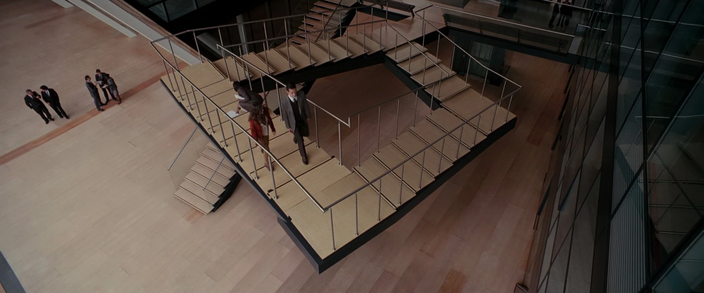

## 개요

영화 '인셉션'의 펜로즈 계단에서 영감을 받은, 3D 착시를 이용해 길을 연결하고 목적지까지 도달하는 웹 퍼즐 게임

<dl class="grid grid-cols-[max-content_1fr] gap-x-6 gap-y-2 [&_dd]:m-0 [&_dd]:p-0 [&_dt]:m-0 [&_dt]:font-semibold">
  <dt>기간</dt>
  <dd>기획 5일 + 개발 18일 (2023.03, 총 약 3주)</dd>
  <dt>인원</dt>
  <dd>FE 3명</dd>
</dl>

## 기획 의도

영화 '인셉션'에서 아서가 아리아드네에게 꿈 설계 방법에 대해 설명할 때, 펜로즈 계단과 패러독스에 대해 얘기하는 장면이 있습니다.

현실에선 불가능한 역설이 꿈에서 가능한 것처럼 **웹에서도 가능**합니다.

이 프로젝트는 보이는 구조와 실제 구조의 차이를 이용하여 불가능해 보이는 목적지에 도달하는 경험을 사용자에게 제공하고자 기획했습니다.

## 담당 역할 & 기여

### Path의 Graph 자료구조 구현

- 3차원 좌표 배열을 직렬화 한 값을 Key로 사용하는 Map 기반 Graph 자료구조 설계, **O(1)** 조회 처리
- Prototype 기반 OOP 구조로 Graph 조작 로직을 캡슐화하고 메소드를 인스턴스 간 공유하도록 설계

### BFS 기반 Path 알고리즘 구현

- 플레이어 위치를 시작점으로 **BFS**(너비 우선 탐색)를 수행하고, `visited Set`으로 중복 탐색을 방지해 실제 이동 가능한 경로만 Graph로 생성
- 블록의 높이가 같아도 인접하지 않거나 위가 블록으로 막힌 좌표는 제외해, 이동할 수 없는 경로가 연결되지 않도록 처리
- 착시로 길이 연결되면 떨어진 두 개의 Graph를 병합해 새 경로를 동적으로 생성하고, 링크가 해제되면 현재 위치를 기준으로 경로를 다시 생성해 연결 전 상태로 복귀

### 키보드 기반 캐릭터 조작 구현

- 방향키와 WASD 입력으로 캐릭터 이동, 회전, 애니메이션, 효과음을 하나의 조작 시스템으로 구현
- 실제로 길이 이어진 칸으로만 이동할 수 있게 이동 가능 여부를 검증하고, 착시로 연결된 지점에서는 떨어진 길로 순간 이동하도록 구현
- 캐릭터의 이동과 동작을 부드럽게 애니메이션 처리하고, 걸음과 동작에 맞춰 효과음을 재생
- 목적지 도착을 자동으로 감지해 도착 연출 후 다음 스테이지로 진행하고 상태를 초기화

### Redux Toolkit을 이용해 게임 전역 상태 설계

- 착시 감지 컴포넌트(AutoSnap)에서 발생한 연결 상태를 경로 생성, 플레이어 제어 등 여러 로직이 공유하도록 전역 관리해 Prop Drilling 제거
- 플레이어 현재 위치를 캐릭터 이동, 경로 재생성, 스테이지 이벤트에서 함께 참조하도록 중앙 관리

### 협업

- 게임 아이디어 및 핵심 플레이 컨셉 기획
- ESLint, Husky 등 프로젝트 기초 설정
- 팀 내 Git 관리
